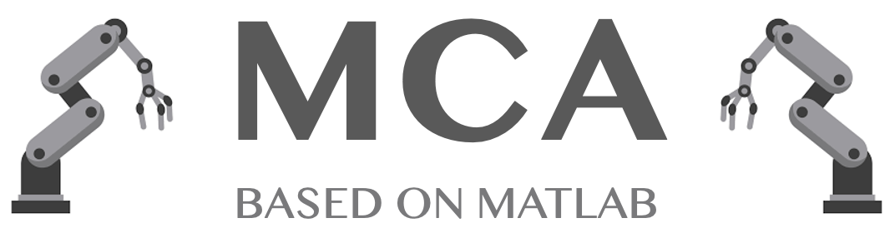

 

  

  

  <strong>Mutual-Collision-Avoidance Scheme Synthesized by Neural Networks for Dual Redundant Robot Manipulators Executing Cooperative Tasks</strong>
  

  
  
  

## About
This repository contains the MATLAB implementation of <a href="">Mutual-Collision-Avoidance Scheme Synthesized by Neural Networks for Dual Redundant Robot Manipulators Executing Cooperative Tasks</a> (MCA).

## Content
Coming soon.
